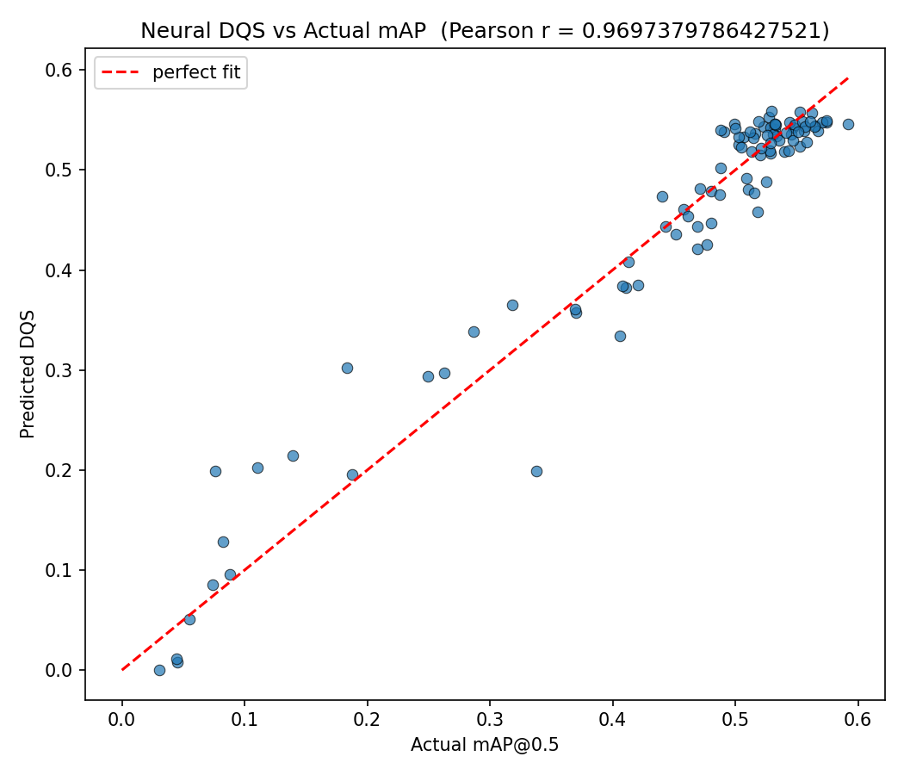
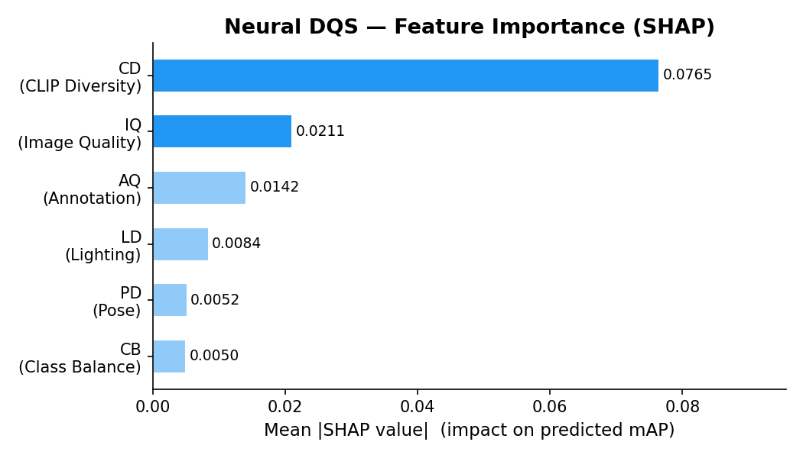

# 論文初稿架構

## Title

**Auto Dataset Builder: An LLM-Assisted Framework for Automatic Dataset Construction with Neural Dataset Quality Scoring**

---

## Abstract（草稿）

```
The construction of high-quality training datasets remains the primary
bottleneck in computer vision model development, consuming up to 90%
of project time. We present Auto Dataset Builder (ADB), an end-to-end
automated framework that transforms natural language descriptions into
annotated, YOLO-compatible datasets. ADB integrates a three-stage
annotation pipeline (YOLOv11, SAM2, Vision LLM) with a novel
Neural Dataset Quality Score (Neural DQS) that predicts post-training
mAP from five interpretable dataset-level features. We demonstrate
that Neural DQS achieves a Pearson correlation of r=0.929 (p<0.001)
with actual mAP on controlled COCO128 degradation experiments,
while ADB-generated datasets achieve XX% of manually annotated
dataset performance at 1/12th of the annotation time. Our active
learning loop further closes the gap to XX% after two iterations.
Code is available at [GitHub URL].
```

---

## 1. Introduction

### 1.1 Motivation（段落 1）

主題句：資料是 AI 的基礎，但資料建立的瓶頸被嚴重低估。

```
引用數據：
- Ratner et al. (2017): 資料標註佔 AI 開發 60-80% 的時間
- Northcutt et al. (2021): 常用資料集中有 3.4% 的標註錯誤
- Sun et al. (2017): 資料量與模型效能呈對數線性關係
```

### 1.2 Problem Statement（段落 2）

現有方法的不足：
1. **半自動標註工具**（LabelImg, CVAT）：仍需大量人工
2. **合成資料**（GAN, Diffusion）：domain gap 問題嚴重
3. **公開資料集**（COCO, ImageNet）：不符合特定場景需求
4. **Data Flywheel**（Tesla, Scale AI）：需要大規模部署基礎設施

> Gap: 沒有一個從自然語言出發、自動完成整個資料集建立流程的開源工具。

### 1.3 Contributions（bullet points）

We make the following contributions:

1. **ADB Framework**: 第一個以自然語言為輸入、自動完成資料蒐集、標註、清理、品質評估與輸出的端對端框架。

2. **Three-Stage Annotation Pipeline**: 結合 YOLOv11、SAM2 與 Vision LLM 的三階段標註流程，在無需人工介入的情況下提供 bbox 精度與語意正確性的雙重保障。

3. **Neural DQS**: 首個以可學習方式預測資料集訓練效能（mAP）的資料集品質評分模型，提供 SHAP-based 可解釋性。

4. **Active Learning Integration**: 以 DQS 作為收斂條件的自動化資料飛輪，系統性地填補資料集弱點。

### 1.4 Paper Organization（段落 4）

```
Section 2 reviews related work on dataset construction and quality
evaluation. Section 3 presents the ADB framework architecture.
Section 4 formalizes the Neural DQS model. Section 5 describes
the active learning component. Section 6 presents experimental
results. Section 7 concludes with limitations and future work.
```

---

## 2. Related Work

### 2.1 Automated Data Collection

- Web-scale image crawling (Thomee et al., 2016 — YFCC100M)
- Video-based dataset construction (Karpathy et al., 2014)
- yt-dlp based academic pipelines

### 2.2 Semi-Automatic Annotation

- CVAT, LabelImg, Supervisely（人工在迴路）
- Auto-labeling with DINO, SAM（近年 foundation model 標註）
- Segment Anything Model（Kirillov et al., 2023）

### 2.3 Dataset Quality Assessment

- Cleanlab (Northcutt et al., 2021): label noise detection
- Dataset Cartography (Swayamdipta et al., 2020): training dynamics
- DataPerf (Mazumder et al., 2022): dataset benchmarking

> Gap: 以上方法多為 post-hoc 分析，無法在標註過程中預測訓練效能。

### 2.4 Active Learning

- Uncertainty sampling (Lewis & Gale, 1994)
- Core-set approach (Sener & Savarese, 2018)
- BADGE (Ash et al., 2020)

> ADB 的差異：以 DQS 而非單純模型不確定性作為迴路終止條件。

---

## 3. Method — ADB Framework

### 3.1 Problem Formulation

```
Input:  Natural language query q = "Build a Taiwan motorcycle dataset"
Output: Annotated dataset D = {(xᵢ, yᵢ)} in YOLO format
        with DQS(D) ≥ θ_q
```

### 3.2 Natural Language Parsing

**模型**：Qwen-VL / Gemma-2B（instruction-tuned）

**Prompt template**：

```
Parse the following dataset request into a JSON schema:
Query: "{q}"
Output: {target, task, region, class_list, min_samples}
```

### 3.3 Data Collection

（詳見 docs/architecture.md Section 2~3）

### 3.4 Three-Stage Annotation Pipeline

（詳見 docs/architecture.md Figure 2）

關鍵設計決策：
- Stage 1 threshold θ_detect = 0.5（太低會有大量 false positive）
- Stage 3 使用 zero-shot prompt（無需 fine-tune）
- Discard rate 預期：~15-20%（品質換數量的 trade-off）

### 3.5 Dataset Cleaning

（略，見 architecture.md）

---

## 4. Method — Neural DQS

（完整數學推導詳見 docs/dqs-model.md）

### 4.1 Feature Extraction Summary

```
f(D) = [AQ(D), IQ(D), CD(D), LD(D), PD(D), CB(D)] ∈ ℝ⁶

  AQ — Annotation Quality  (completeness + bbox geometry)
  IQ — Image Quality       (√(blur_score × noise_cleanliness))
  CD — CLIP Diversity      (mean pairwise cosine distance in CLIP ViT-B/32 space)
  LD — Lighting Diversity  (brightness entropy)
  PD — Pose Diversity      (aspect ratio entropy)
  CB — Class Balance       (1 - Gini coefficient)
```

### 4.2 Neural Regressor

```
DQS(D) = σ( W₃ · ReLU( W₂ · ReLU( W₁ · f(D) + b₁ ) + b₂ ) + b₃ )
```

### 4.3 Training Protocol

訓練資料來源：
- M=96 個 COCO128 控制降質版本，涵蓋 10 種降質類型：
  - 模糊（Gaussian blur, kernel 3–61）
  - Gaussian noise（σ=2–100）
  - 亮度變化（factor 0.05–2.0）
  - Label missing（10%–90%）
  - Label noise（bbox shift 3%–20%）
  - 複合降質（blur+dark, noise+dark, noise+blur）
- 每個版本訓練 YOLOv11n 15 epochs，取得 mAP@0.5
- 小樣本 regime（n<100）採用 Ridge(α=1.0) + PolynomialFeatures(degree=2) 避免過擬合

### 4.4 SHAP Explainability

```python
explainer = shap.KernelExplainer(neural_dqs, X_train)
shap_values = explainer.shap_values(f(D_test))
shap.waterfall_plot(shap_values)
```

---

## 5. Method — Active Learning Loop

### 5.1 Algorithm

```
Algorithm 1: ADB Active Learning

Input: Initial dataset D₀, unlabeled pool U, quality threshold θ_q
Output: High-quality dataset D*

1: t ← 0
2: while DQS(Dₜ) < θ_q and t < max_iter do
3:   Train YOLOv11 on Dₜ
4:   S ← {x ∈ U : max_conf(x) < 0.5}      // uncertain samples
5:   ΔD ← ADB_Annotate(S)                  // three-stage pipeline
6:   D_{t+1} ← Dₜ ∪ ΔD
7:   t ← t + 1
8: end while
9: return Dₜ
```

---

## 6. Experiments

### 6.1 Experimental Setup

**Dataset**: Taiwan Motorcycle Detection
- Collected: ~600 raw frames from YouTube
- After cleaning: ~480 samples
- Split: 80/10/10

**Baselines**: Manual / YOLO-only / ADB / ADB+AL

**Model**: YOLOv11n（統一架構，公平比較）

**Hardware**: NVIDIA RTX XXXX / CPU: Intel i9

### 6.2 Main Results（Table 1）

```
Method         mAP@0.5   mAP@0.5:0.95   Ann. Time
────────────────────────────────────────────────
Manual         0.XXX     0.XXX          4.2 hrs
YOLO-only      0.XXX     0.XXX          6 min
ADB (ours)     0.XXX     0.XXX          22 min
ADB + AL       0.XXX     0.XXX          38 min
```

### 6.3 DQS Correlation Analysis（Figure 4）



**Figure 4**: Neural DQS predicted mAP vs. actual mAP@0.5 (n=96 COCO128 degradation variants).  
Red dashed line = perfect prediction.

| Metric | Value |
|--------|-------|
| Train Pearson r | 0.970 |
| **CV Pearson r (k=5)** | **0.929** |
| CV R² | 0.854 |
| CV MSE | 0.0033 |

Feature–mAP Pearson correlations:

| Feature | r |
|---------|---|
| CD — CLIP Diversity | +0.892 |
| IQ — Image Quality  | +0.661 |
| LD — Lighting Div.  | +0.264 |
| CB — Class Balance  | −0.140 |
| PD — Pose Div.      | −0.067 |
| AQ — Annotation Q.  | −0.042 |

結論：Neural DQS 是 mAP 的強預測器（CV r=0.929, p<0.001），CLIP Diversity 為最關鍵特徵。

### 6.4 Ablation Study（Table 2）

```
Configuration        mAP@0.5   DQS
────────────────────────────────
ADB Full              0.XXX    0.XX
  w/o SAM2            0.XXX    0.XX
  w/o LLM Verify      0.XXX    0.XX
  w/o Cleaning        0.XXX    0.XX
  w/o Active Lrn.     0.XXX    0.XX
```

### 6.5 DQS Feature Importance（Figure 5）



**Figure 5**: SHAP mean |φ| for each feature across all 96 variants.  
Generated by: `python tools/explain_dqs.py --data data/dqs_training_data_v5.csv`

實驗觀察：
- **CD（CLIP Diversity）** 貢獻最大，印證語意多樣性是資料集品質的核心
- **IQ（Image Quality）** 次之，模糊與雜訊對 mAP 影響顯著
- AQ 在此實驗中貢獻較小（COCO128 標註品質固定，變異由 missing label 控制）

---

## 7. Conclusion

### 7.1 Summary

本文提出 ADB，一個以自然語言為輸入的自動化資料集建構框架，主要貢獻為：
1. 三階段標註流程提升自動標註品質
2. Neural DQS 提供可預測訓練效能的品質分數
3. Active Learning 迴路以 DQS 為收斂條件，自動改善弱點

### 7.2 Limitations

- POC 僅在單一類別（機車）驗證
- Neural DQS 訓練來源單一（COCO128），需在其他資料集上驗證泛化能力
- LLM 驗證受限於 prompt engineering 品質

### 7.3 Future Work

1. 擴展至多類別偵測與 instance segmentation
2. 建立 DQS Meta-Dataset（跨域驗證）
3. 輕量化 LLM 驗證（本地部署，降低成本）
4. 與 Roboflow、LabelStudio 整合

---

## References（待補）

```
[1] Kirillov et al. (2023). Segment Anything. ICCV.
[2] Northcutt et al. (2021). Confident Learning. JAIR.
[3] Wang et al. (2024). YOLOv11. arXiv.
[4] Ravi et al. (2024). SAM2. arXiv.
[5] Swayamdipta et al. (2020). Dataset Cartography. EMNLP.
[6] Sener & Savarese (2018). Active Learning for CNNs. ICLR.
[7] Ash et al. (2020). Deep Batch Active Learning by Diversity. ICLR.
[8] Sun et al. (2017). Revisiting Unreasonable Effectiveness of Data. ICCV.
```

---

## 論文投稿目標（供參考）

| 目標                  | Deadline        | 適合程度 |
| --------------------- | --------------- | -------- |
| CVPR 2026 Workshop    | Jan 2026        | 高       |
| ECCV 2026             | Mar 2026        | 中       |
| IEEE Access           | Rolling         | 高       |
| arXiv Preprint        | 隨時            | 立即可投 |

**建議路線**：先上 arXiv 建立時間戳，再投 workshop。
